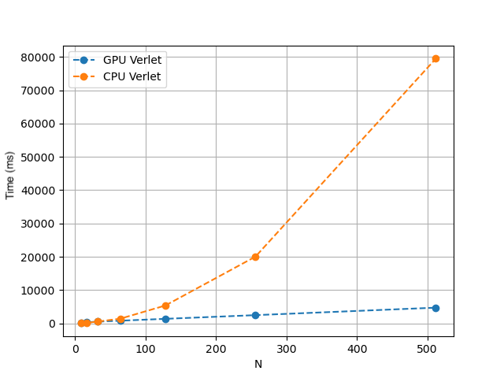

# N-Body CUDA Simulation

This project implements an N-Body simulation using CUDA for parallel computation. The simulation calculates the gravitational interactions between a large number of bodies, making use of GPU acceleration to handle the computational load efficiently.

## Project Description

The N-Body problem involves predicting the individual motions of a group of celestial objects interacting with each other gravitationally. This project was developed as part of a university course to demonstrate the use of CUDA for high-performance computing.

## Prerequisites

Before you begin, ensure you have met the following requirements:
- A CUDA-capable GPU
- NVIDIA CUDA Toolkit installed
- CMake version 3.10 or higher
- A C++ compiler compatible with CUDA

## Building the Project

To build the project, follow these steps:

1. Clone the repository:
    ```sh
    git clone <repository-url>
    cd N-Body-CUDA
    ```

2. Create a build directory and navigate into it:
    ```sh
    mkdir build
    cd build
    ```

3. Run CMake to configure the project:
    ```sh
    cmake ..
    ```

4. Build the project using Make:
    ```sh
    make
    ```

## Usage

### Running the Simulation

To run the N-Body simulation, use the following command:
```sh
./nbody_sim_cuda <initial_states_file> <output_file> <dt> <num_steps> <block_size>
```
- `<initial_states_file>`: Path to the file containing the initial states of the bodies.
- `<output_file>`: Path to the file where the simulation results will be saved.
- `<dt>`: Time step for the simulation.
- `<num_steps>`: Number of simulation steps.
- `<block_size>`: CUDA block size.

### Running the Benchmark

To run the benchmark, use the following command:
```sh
./nbody_cuda_benchmark <num_bodies> <dt> <num_steps> <block_size> <method>
```
- `<num_bodies>`: Number of bodies in the simulation.
- `<dt>`: Time step for the simulation.
- `<num_steps>`: Number of simulation steps.
- `<block_size>`: CUDA block size.
- `<method>`: Simulation method (0 for standard, 1 for velocity Verlet, 2 for optimized).

## Visualization

The project includes a simple Python-based visualization using VisPy to visualize the trajectories generated by the simulation.

### Prerequisites

Before running the visualization, ensure you have the following Python packages installed:
- numpy
- vispy
- seaborn

You can install these packages using pip:
```sh
pip install numpy vispy seaborn
```

### Running the Visualization

To run the visualization, use the following command:
```sh
python visualization_canvas.py
```

Make sure the `initial_conditions.txt` and `trajectories.txt` files are in the same directory as the `visualization_canvas.py` script. These files should contain the initial conditions and the trajectories generated by the simulation, respectively.

## Implemented Kernels

The project implements three different CUDA kernels for the N-Body simulation:

1. **Standard N-Body Simulation**: Each thread updates a single body by calculating the gravitational forces from all other bodies.
2. **Velocity Verlet Integration**: Similar to the standard method, but uses the Velocity Verlet algorithm for better numerical stability.
3. **Optimized N-Body Simulation**: Each thread calculates each physical interaction between bodies. This method aims to be faster but currently does not work properly and is very slow.

## Performance Comparison

The following plot compares the compute time on CPU (Ryzen 9 3900X) and GPU (RTX 4090) with a block size set to 256.



## Acknowledgments

This project was developed during university classes. Special thanks to the course instructors and teaching assistants for their guidance and support.
